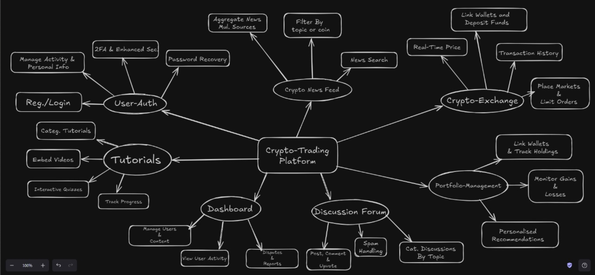

 # Crypto-(Use Cases):

### Core Features & Use Cases for Crypto Exchange Web App

- **User Authentication & Profile Management**
  - User registration, login, password reset, 2FA
  - Manage personal details, track progress on tutorials/quizzes
  - **Tech Stack:** React.js (JWT), Node.js (Express.js), MongoDB, Passport.js/Auth0 (OAuth)

- **Crypto Exchange**
  - Real-time prices, wallet integration, market/limit orders, transaction history
  - **Tech Stack:** React.js (Redux, Chart.js/D3.js), Node.js (Express.js), MongoDB, WebSockets, Exchange APIs (Binance, Coinbase)

- **Crypto News Feed**
  - Aggregate/filter crypto news, trending topics
  - **Tech Stack:** React.js, NewsAPI, Puppeteer/Cheerio, Redis caching

- **Crypto Tutorials (Text, Video, Quizzes)**
  - Skill-based tutorials, videos, interactive quizzes, progress tracking
  - **Tech Stack:** React.js (Video.js, TinyMCE), MongoDB, Firebase (push notifications)

- **Portfolio Management**
  - Track holdings, gains/losses, portfolio visualizations
  - **Tech Stack:** React.js (Chart.js/Highcharts), MongoDB, Web3.js, Ethers.js

- **Discussion Forum (Optional)**
  - User posts, comments, voting, spam protection, real-time discussions
  - **Tech Stack:** React.js (TinyMCE/Draft.js), MongoDB, WebSockets (Socket.IO), CAPTCHA

- **Admin Dashboard**
  - Manage users, tutorials, analytics, handle disputes/flagged content
  - **Tech Stack:** React.js (Material-UI/Ant Design), Node.js, MongoDB, D3.js/Chart.js

### Extended Tech Stack Suggestions
- **Blockchain Interaction:** Web3.js, Ethers.js
- **Security:** bcrypt, JWT, 2FA (speakeasy)
- **API Integrations:** CoinGecko, CoinMarketCap, Binance, Coinbase APIs
- **Cloud/DevOps:** Docker, Kubernetes, CI/CD (GitHub Actions, Travis CI)
- **Performance Optimization:** Redis, CDN